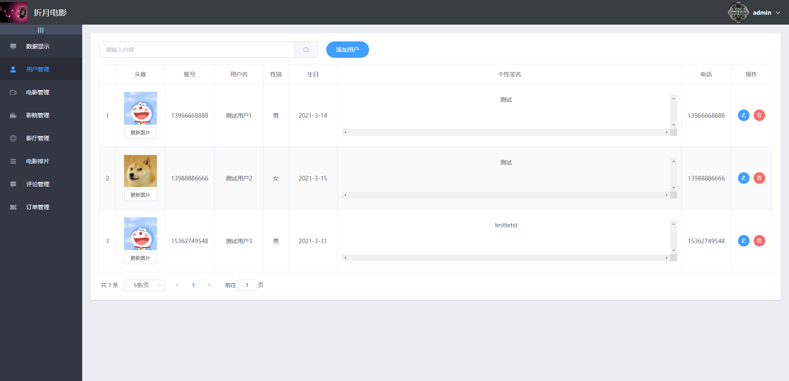
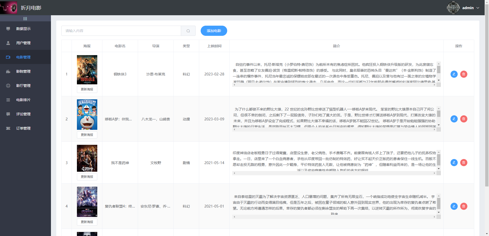

# SpringgBoot+vue影院售票系统

**项目背景与目标：**
影院作为娱乐文化领域的重要一环，需要一个高效的售票系统来满足观众的需求。基于这一目标，我们团队决定开发一个结合Spring Boot和Vue的智能影院售票系统，旨在提供便捷的电影购票体验。

**功能特点：**
1️⃣ 电影浏览：观众可以浏览正在上映的电影列表、详细信息以及放映时间表。

2️⃣ 选座购票：观众可以通过座位图选择座位，实时查看座位情况，完成购票流程。

3️⃣ 订单管理：观众可以查看已购买的电影票订单，方便进行订单管理和查阅。

4️⃣ 影院管理：管理员可以管理影院信息、电影信息、排片信息等。

**技术与工具：**
1️⃣ 后端：使用Spring Boot框架开发后端逻辑，实现业务逻辑和数据库管理。

2️⃣ 前端：采用Vue.js框架构建前端页面，实现与用户的交互界面。

3️⃣ 数据库：使用MySQL数据库存储电影、订单和座位信息，实现数据的持久化存储。

4️⃣ 接口通信：前后端通过RESTful API进行数据传输和交互。
 **

### 源码小偿+qq1755320514
** 

